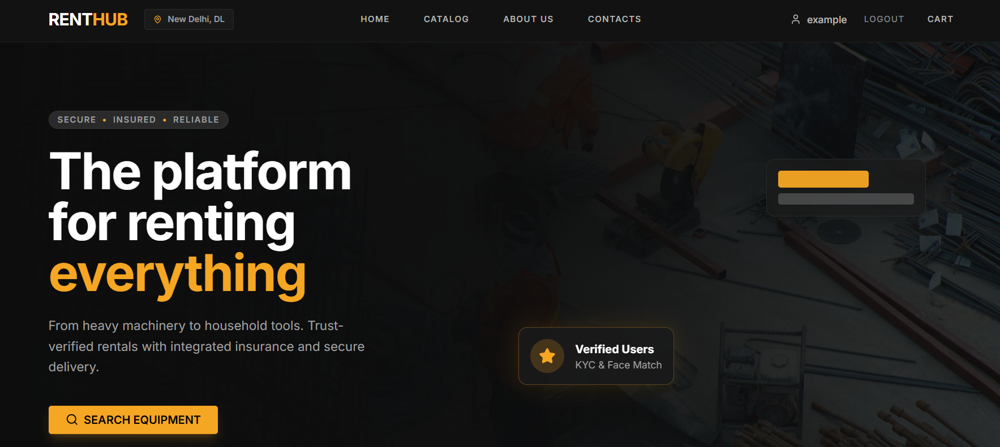
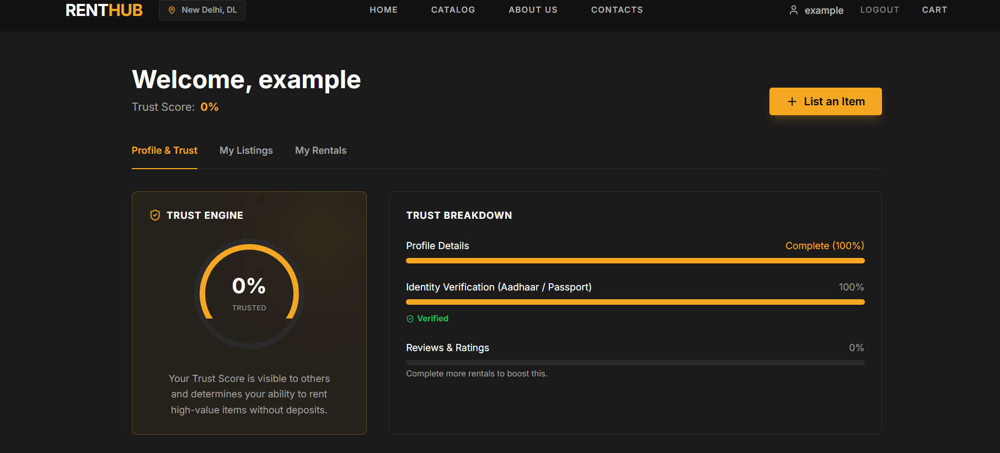
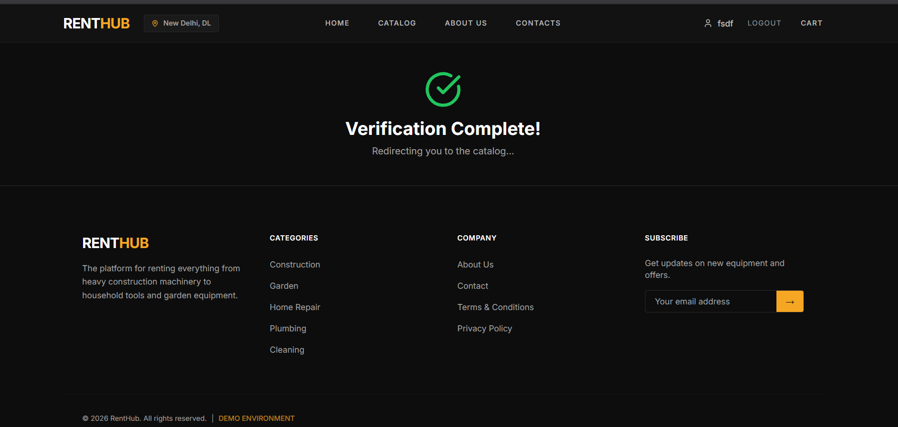

# RentHub

## Problem Statement

Most homes own tools they use a few times a year (drills, ladders, power washers, lawn mowers), while other people buy the same expensive tools for a single job. Renting from neighbours is the obvious fix, but it barely happens because owners won't lend to a stranger: they fear theft, damage, no-shows and deposit disputes. Earlier rental platforms in India have stalled on exactly this trust gap.

RentHub solves the trust problem so idle tools can earn money for their owners and save money for borrowers.

## Project Description

RentHub is a peer-to-peer marketplace in India for renting everything from heavy machinery to household tools. Owners list an item with photos and availability; renters book it for the dates they need. Every rental runs through a trust stack designed to make lending to a stranger safe:

1. **Identity verification:** KYC with face match before a user can rent
2. **Dynamic trust score:** each user builds a trust score, and it sets their security deposit tier (lower trust means a higher deposit)
3. **Escrow deposit:** the security deposit is held and released after a clean return
4. **Micro-insurance:** each rental is covered by insurance
5. **Photo verification:** photos are taken at handover and at return, so condition is documented
6. **Booking workflow:** owners accept or reject requests, and either side can cancel

In the 32-hour hackathon MVP, the KYC, OTP and payment steps run in mock mode, and the booking, trust and deposit logic runs on a real backend and database.

---

## Google AI Usage

### Tools / Models Used

- TODO: e.g. Gemini model name / API

## Tech Stack used

- React + Vite (frontend)
- Next.js API routes (backend)
- Supabase: Postgres with Row Level Security, file storage (listing photos, handover photos, uploads)
- Vercel (hosting)
- Planned integrations, mocked in the MVP: Aadhaar/DigiLocker KYC, Razorpay, Acko, Twilio SMS

### How Google AI Was Used

TODO: explain where the AI sits in the product and what it does for the user.

---

### GitHub repo link of the project

[Link of the github repository](https://github.com/Govindv7555/RentHub-VulcanExe)

## Proof of Google AI Usage

Proof is included in the `/proofs` folder.

## Screenshots

Project screenshots are in the `/screenshots` folder.





---

## Demo Video

https://drive.google.com/file/d/11_0bEWGOpiEqMPoBRkSCyCblUIoQmbLX/view?usp=sharing

---

## Installation Steps

```bash
# 1. Clone the repo
git clone https://github.com/Govindv7555/RentHub-VulcanExe.git
cd RentHub-VulcanExe

# 2. Backend: add environment variables, then start it (port 8000)
cd backend
cp ../.env.example .env.local   # fill in the Supabase keys
npm install
npm run dev

# 3. Frontend (new terminal): start it (port 5173)
cd frontend
npm install
npm run dev
```

Open http://localhost:5173.

The app runs with `MOCK_OTP=true` and `MOCK_KYC=true`, so the demo OTP code is `123456`.
